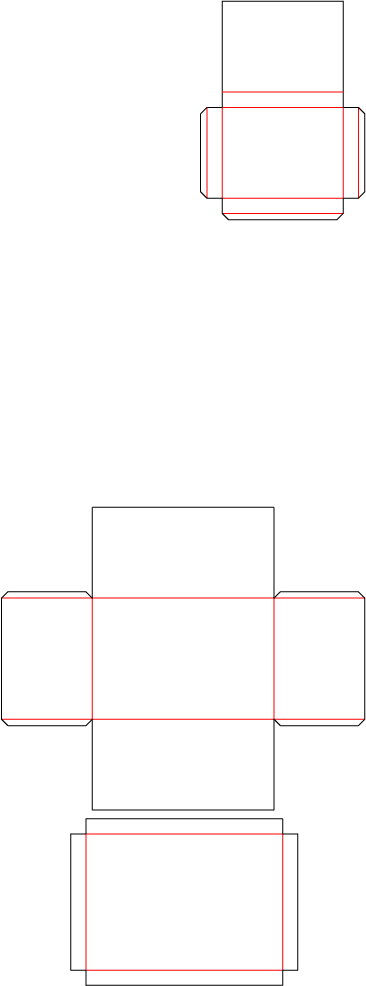
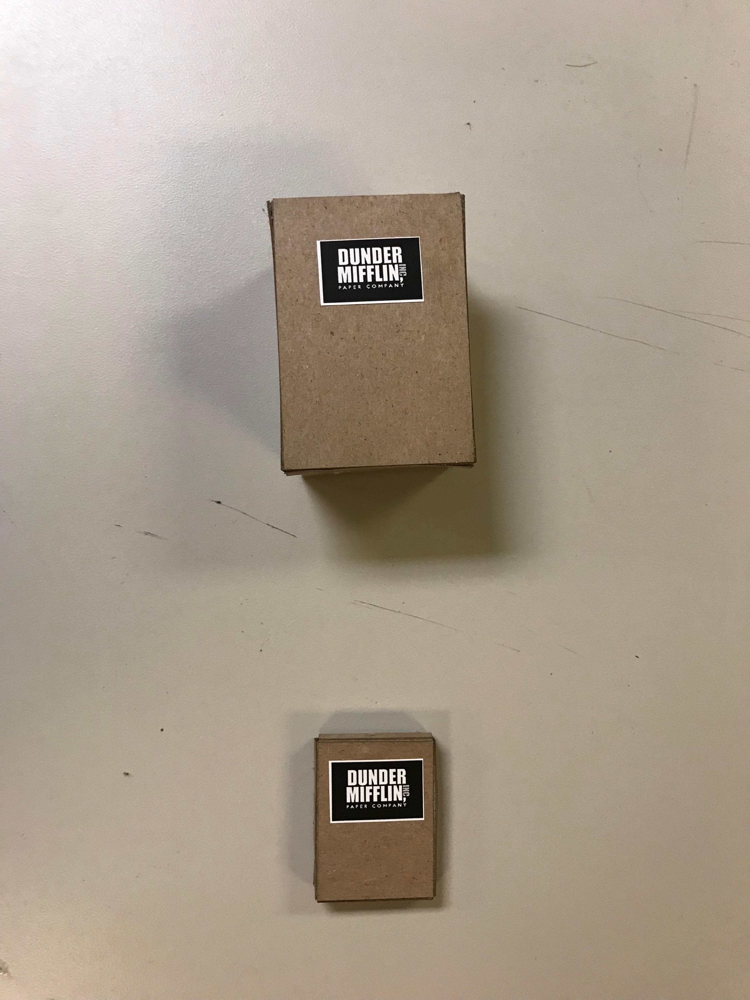
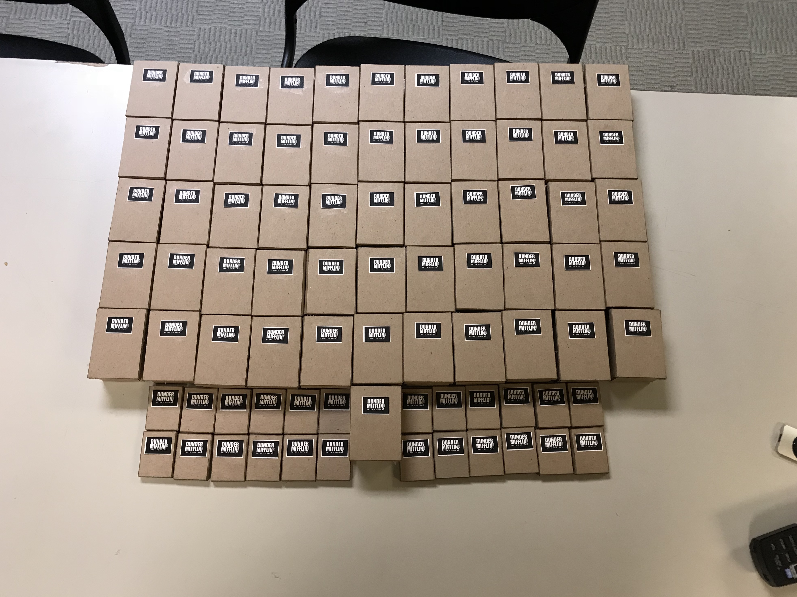

# Final Project Documentation

My original idea was to provide a physical representation of every line spoken by every character in the office, separated by season. This, I would soon come to learn, was a very ambitious project. I wrote the following script to get me the number of lines per season, as well as the number of lines per character per season. 

```Python
import csv
import io
import re
import operator
from collections import Counter

def get_season_line_counts(file_path):
	with open (file_path) as f:
		S1 = 0
		S2 = 0
		S3 = 0
		S4 = 0
		S5 = 0
		S6 = 0
		S7 = 0
		S8 = 0
		S9 = 0
		S1_chars = []
		S2_chars = []
		S3_chars = []
		S4_chars = []
		S5_chars = []
		S6_chars = []
		S7_chars = []
		S8_chars = []
		S9_chars = []
		append1 = False
		append2 = False
		append3 = False
		append4 = False
		append5 = False
		append6 = False
		append7 = False
		append8 = False
		append9 = False
		lines = csv.reader(f, delimiter = ',')
		for row in lines: 
			if row[6] == "FALSE":
				if row[1] == "1":
					S1 = S1 + 1
					if append1:
						with open("S1_chars.txt", "a") as f:
							f.write(row[5])
							f.write('\n')
					else:
						with open("S1_chars.txt", "w") as f:
							f.write(row[5])
							f.write('\n')
							append1 = True
				elif row[1] == "2":
					S2 = S2 + 1
					if append2:
						with open("S2_chars.txt", "a") as f:
							f.write(row[5])
							f.write('\n')
					else:
						with open("S2_chars.txt", "w") as f:
							f.write(row[5])
							f.write('\n')
							append2 = True
				elif row[1] == "3":
					S3 = S3 + 1
					if append3:
						with open("S3_chars.txt", "a") as f:
							f.write(row[5])
							f.write('\n')
					else:
						with open("S3_chars.txt", "w") as f:
							f.write(row[5])
							f.write('\n')
							append3 = True
				elif row[1] == "4":
					S4 = S4 + 1
					if append4:
						with open("S4_chars.txt", "a") as f:
							f.write(row[5])
							f.write('\n')
					else:
						with open("S4_chars.txt", "w") as f:
							f.write(row[5])
							f.write('\n')
							append4 = True
				elif row[1] == "5":
					S5 = S5 + 1
					if append5:
						with open("S5_chars.txt", "a") as f:
							f.write(row[5])
							f.write('\n')
					else:
						with open("S5_chars.txt", "w") as f:
							f.write(row[5])
							f.write('\n')
							append5 = True
				elif row[1] == "6":
					S6 = S6 + 1
					if append6:
						with open("S6_chars.txt", "a") as f:
							f.write(row[5])
							f.write('\n')
					else:
						with open("S6_chars.txt", "w") as f:
							f.write(row[5])
							f.write('\n')
							append6 = True
				elif row[1] == "7":
					S7 = S7 + 1
					if append7:
						with open("S7_chars.txt", "a") as f:
							f.write(row[5])
							f.write('\n')
					else:
						with open("S7_chars.txt", "w") as f:
							f.write(row[5])
							f.write('\n')
							append7 = True
				elif row[1] == "8":
					S8 = S8 + 1
					if append8:
						with open("S8_chars.txt", "a") as f:
							f.write(row[5])
							f.write('\n')
					else:
						with open("S8_chars.txt", "w") as f:
							f.write(row[5])
							f.write('\n')
							append8 = True
				elif row[1] == "9":
					S9 = S9 + 1
					if append9:
						with open("S9_chars.txt", "a") as f:
							f.write(row[5])
							f.write('\n')
					else:
						with open("S9_chars.txt", "w") as f:
							f.write(row[5])
							f.write('\n')
							append9 = True
				
		print(S1)
		print(S2)
		print(S3)
		print(S4)
		print(S5)
		print(S6)
		print(S7)
		print(S8)
		print(S9)

def word_counts(file_path, file_name):
	with open (file_path) as f:
		file = f.read()

	words = re.findall(r'\w+', file)
	word_count = Counter(words)
	sorted_words = sorted(word_count.items(), key=operator.itemgetter(1))
	sorted_words.reverse()

	with open (file_name, "w") as f:
		for item in sorted_words:
			f.write(str(item))
			f.write("\n")
		print("Wrote new file: " + file_name)

get_season_line_counts("Lines.csv")		

word_counts("S1_chars.txt", "S1_char_counts.txt")
word_counts("S2_chars.txt", "S2_char_counts.txt")
word_counts("S3_chars.txt", "S3_char_counts.txt")
word_counts("S4_chars.txt", "S4_char_counts.txt")
word_counts("S5_chars.txt", "S5_char_counts.txt")
word_counts("S6_chars.txt", "S6_char_counts.txt")
word_counts("S7_chars.txt", "S7_char_counts.txt")
word_counts("S8_chars.txt", "S8_char_counts.txt")
word_counts("S9_chars.txt", "S9_char_counts.txt")
```

Once I had the numbers in front of me I realized that it would be impossible to do all of the laser cutting I had planned. I was planning on cutting out a cardstock box shaped like one paper ships in to represent 1000 lines, and a cardboard box shaped like a paper reem to represent 100 lines. This ended up continuing to be the case. The templates for these boxes looked like this:



The red lines were etched so as to make folding possible, while the black were cut through the material. 

At this point I decided to not attempt to represent each character, but rather simply each season, as that alone was a tall order. I had bigger ideas (representing how much of the show was taken up by the main 3 characters, representing how many episodes were in each season visually) however even these were too much of a stretch.

I started to cut, but ran into an early issue of the material I had chosen to use. It was far to dense to use for this project. Folding it was a nightmare to say the least. I swapped to a lighter material, and proceeded to cut what I thought was the perfect amount of objects; 23 Reems and 55 Boxes. I cut a few extra of each, as to have enough in case I made a mistake in folding. I then spend hours upon hours folding and gluing each one individually. I then cut out small Dunder Mifflin logos to paste to each one. When completed they looked like this: 



Once I had finally gotten them all cut, folded, glued, and applied the logo to each, they looked like this: 



It was then that I realized I was missing 5 reems. Oops. I went back and cut 5 more, although these 5 were cut from a slightly different material, making them vaguely harder to fold. Nonetheless I powered through, got them folded, and applied all of them to a dense cardstock backing. The final product looked like this: 


All in all, I am happy with the results, although I wish I had more time to get all the kinks out, and to truly make this project what I had initially seen it as. 


[Go Back](Philosophy-Of-Data).