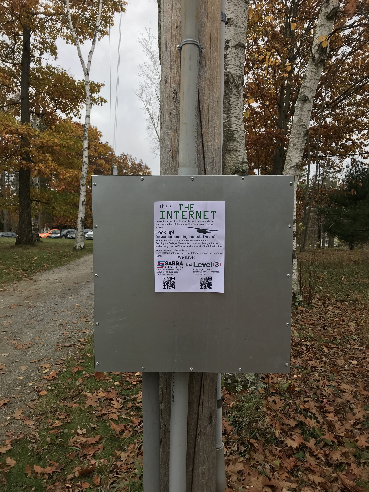
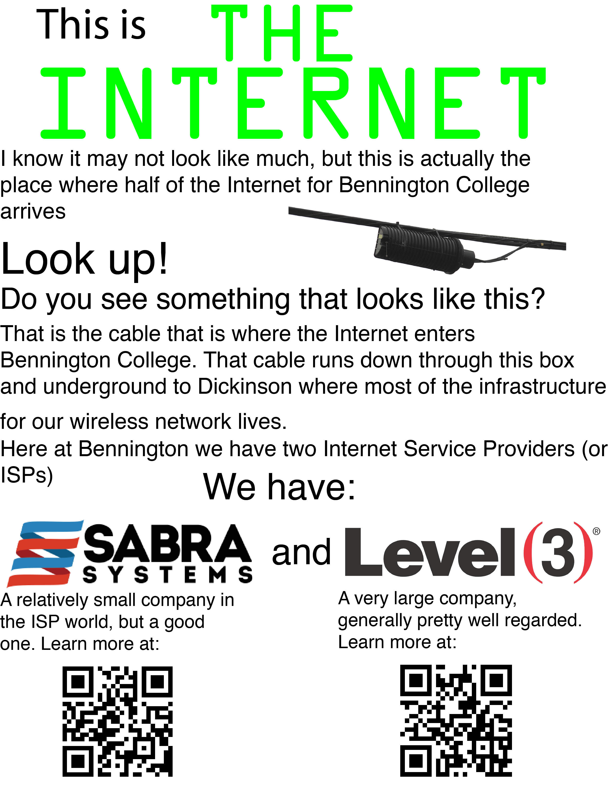

# The Physical Internet at Bennington

To show the students of Bennignton college what the physical Internet is here, I decided to make a flyer and post it on the box where the line of the Internet enters our campus. See images below.

Here is a close up image of the actual flyer I posted.

I wanted to address information that is relatively inaccessible at Bennington, such as what our ISPs are. I not only spread that information, but made it easy for people to learn more with QR codes at the bottom that lead to the website of each of the individual companies. I think that this is a somewhat temporary solution, and kind of out of the way, but I hope that someone will read it and find it helpful. 

[Go Back](The-Internet-Made-Real). 